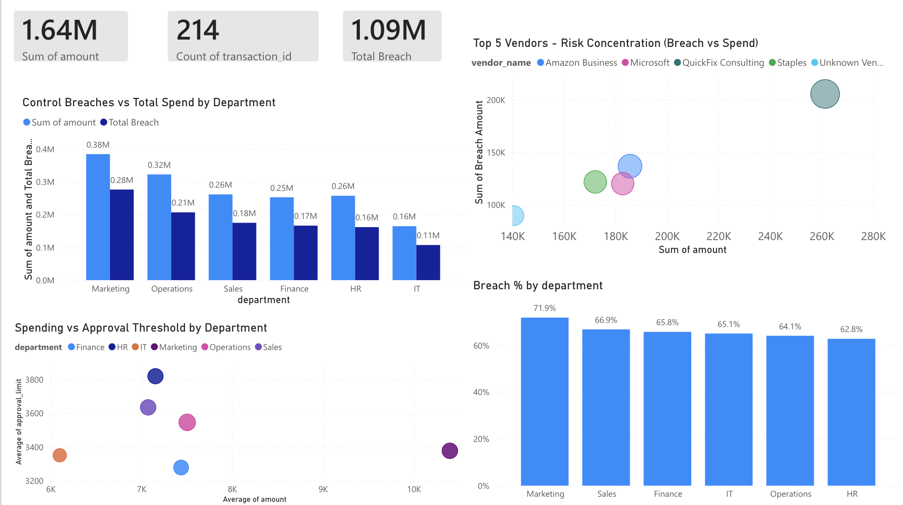
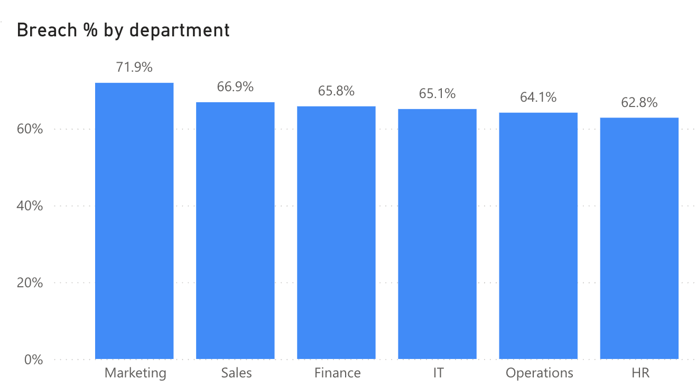
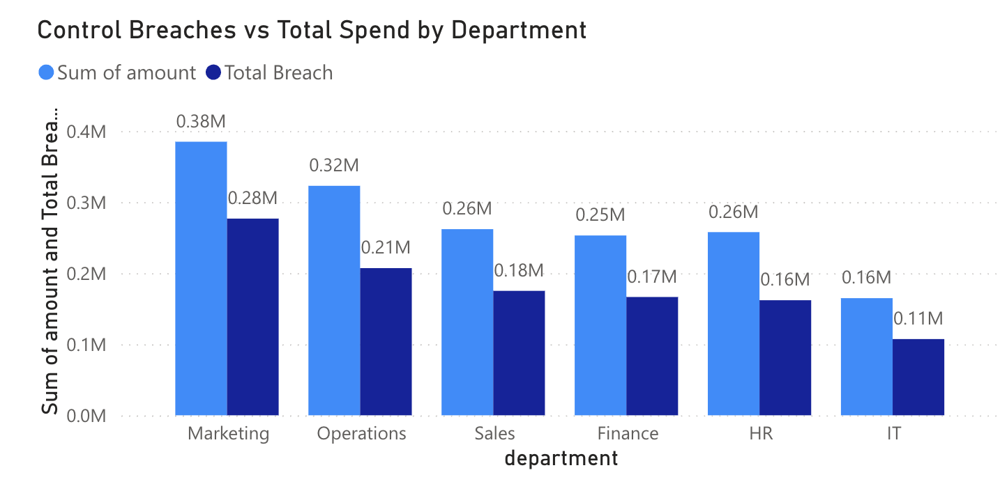
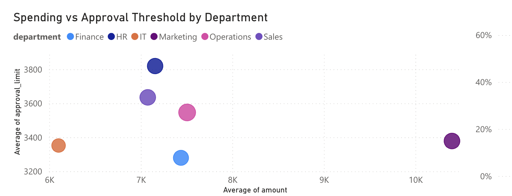
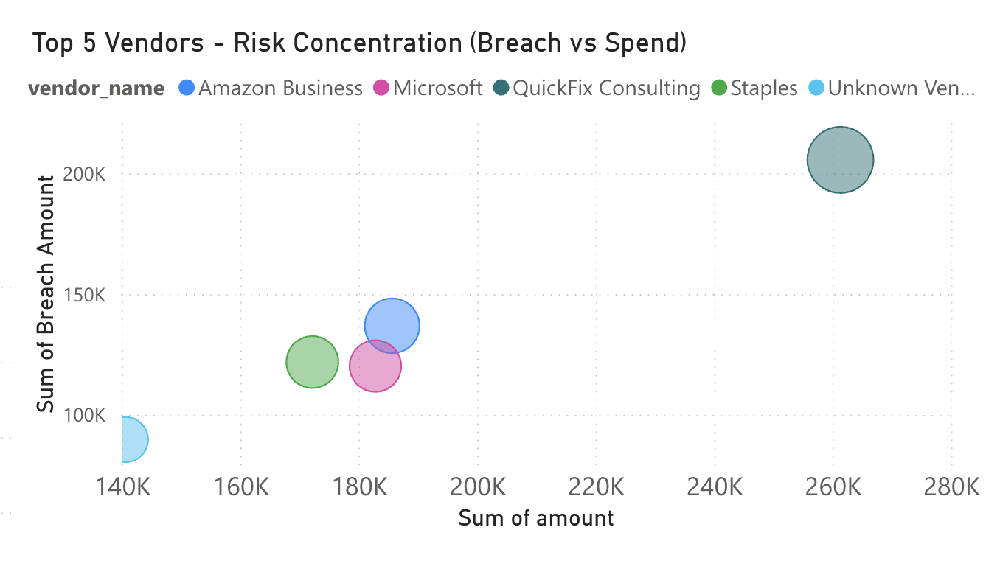

Transaction Monitoring & Internal Controls Framework

Executive Summary
This project simulates a transaction monitoring and internal controls environment using synthetic financial data (1,213 trasactions).
Three automated control tests were designed and implemented in SQL:
	•	Approval limit breaches
	•	Duplicate invoice payments
	•	Potential split payments

A total of 214 control exceptions were identified, representing concentrated financial risk across specific departments and vendors.

Power BI dashboards were developed to quantify breach exposure, highlight vendor-level risk concentration, and evaluate control effectiveness relative to spend and approval thresholds.

The analysis demonstrates how continuous transaction-level monitoring strengthens internal controls, surfaces systemic weaknesses, and enables risk-based prioritization for audit and compliance teams.

Overview

This project simulates a transaction-level monitoring system designed to detect control failures, approval threshold violations, and vendor concentration risk using SQL, Python, and Power BI.

The objective is to move from periodic review to continuous risk monitoring.

System Architecture
	•	Python → Synthetic transaction data generation
	•	SQL → Control breach detection + summary views
	•	Power BI → Executive monitoring dashboard

Key Risk Metrics
	•	Total Spend: $1.64M
	•	Total Breach Amount: $1.09M
	•	214 Transactions
	•	Breach rate across departments: 63–72%

Control Logic

A breach is defined as:

Transaction Amount > Approval Limit

Additional risk concentration analysis performed at:
	•	Department level
	•	Vendor level

Dashboard Insights
Full Dashboard Insugnt:

1. Department Risk Exposure

Story:
	•	Marketing shows the highest breach percentage (~72%).
	•	Risk exposure is not evenly distributed across departments.
	•	Control weakness appears systemic rather than isolated.

Implication:
Internal audit should prioritize departments with elevated breach rates.

2. Control Breaches vs Spend

Story:
	•	Higher spend departments correlate with higher total breach amounts.
	•	Marketing and Operations drive the majority of financial risk.
	•	IT shows lower total exposure relative to spend.

Implication:
High transaction volume increases exposure to control failures.

3. Spending vs Approval Threshold

Story:
	•	Some departments operate closer to their approval limits.
	•	Large average transaction sizes paired with high approval thresholds increase override risk.
	•	Outliers indicate potential policy misalignment.

Implication:
Approval thresholds may need recalibration in certain departments

4. Vendor Risk Concentration

Story:
	•	Risk is concentrated among a small group of vendors.
	•	One vendor shows disproportionately high breach amount relative to spend.
	•	Vendor-level monitoring reveals exposure invisible at department level.

Implication:
Risk is vendor-concentrated, not just department-driven.

Business Implications
	•	High breach concentration suggests weak preventive controls
	•	Vendor-level clustering indicates dependency risk
	•	Certain departments show threshold proximity patterns

Future Enhancements
	•	Risk scoring model
	•	Anomaly detection using statistical thresholds
	•	Automated exception flagging pipeline
